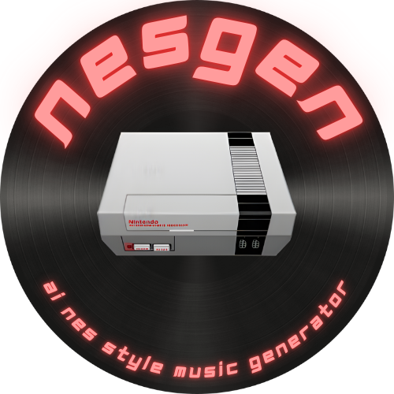

<p align="center"></p>


&nbsp;&nbsp;&nbsp;&nbsp;&nbsp;&nbsp;&nbsp;&nbsp;&nbsp;&nbsp;&nbsp;&nbsp;&nbsp;&nbsp;&nbsp;&nbsp;&nbsp;&nbsp;&nbsp;&nbsp;
&nbsp;&nbsp;&nbsp;&nbsp;&nbsp;&nbsp;&nbsp;&nbsp;&nbsp;&nbsp;&nbsp;&nbsp;&nbsp;&nbsp;&nbsp;&nbsp;&nbsp;&nbsp;&nbsp;&nbsp;
&nbsp;&nbsp;&nbsp;&nbsp;&nbsp;&nbsp;&nbsp;&nbsp;&nbsp;&nbsp;&nbsp;&nbsp;&nbsp;&nbsp;&nbsp;&nbsp;&nbsp;&nbsp;&nbsp;&nbsp;&nbsp;&nbsp;&nbsp;
&nbsp;&nbsp;&nbsp;&nbsp;&nbsp;&nbsp;&nbsp;&nbsp;&nbsp;&nbsp;&nbsp;&nbsp;
[![Language][python-shield]][python-url]
[![Apache License][license-shield]][license-url]

---

Training of IA models to generate music in MIDI format, resembling old NES videogames sountracks. 

Project for Deep Learning course a.y. 2023-2024.

## Available code

In this repository we present two possible approaches for generating MIDI music, each with its own Jupyter Notebook.

Transformer approach:
<a target="_blank" href="https://colab.research.google.com/github/roostico/NesGen/blob/main/NESGEN_Transformer.ipynb">
  
</a>

GAN approach:
<a target="_blank" href="https://colab.research.google.com/github/roostico/NesGen/blob/main/NESGEN-GAN.ipynb">
  
</a>

## Useful links

Here's some useful links:

| Artifact                      | Link                                                                                  | Size    |
|-------------------------------|---------------------------------------------------------------------------------------|---------|
| NESGEN_Maestro15.zip          | https://drive.google.com/file/d/1qoTIkmhmj0z4854FFofz02KLk5DnyqB1/view?usp=drive_link | 175 MB  |
| NESGEN_Nesmdb5.zip            | https://drive.google.com/file/d/1FfofRGCzuD6x54Q3mF2c_f50wuzbPp_i/view?usp=drive_link | 175 MB  |
| NESGEN_gan50                  | https://drive.google.com/file/d/1XN71Mnc3C4gzr1w8u5xgcOAsX9zNds-m/view?usp=drive_link | 1.54 GB |
| maestro_tokenizer.json        | https://drive.google.com/file/d/1SDRkoWwyuSl4udoCHdcitjLLm9d0kfxS/view?usp=drive_link | 1.6 MB  |
| nes_tokenizer.json            | https://drive.google.com/file/d/1ul-khIle1ue9oUGqb1Z7qHxk7LSuxrWw/view?usp=drive_link | 1.9 MB  |
| gan_tokenizer                 | https://drive.google.com/file/d/1Uf734gntq6RLpAvcruWuKcHqPmcZ_4O8/view?usp=drive_link | 212 KB  |
| all_ids_maestro_train.txt     | https://drive.google.com/file/d/1IQToXD9s8g4L-AlK-MY4qvGoLZ-p7bMw/view?usp=drive_link | 1.19 GB |
| all_ids_maestro_valid.txt     | https://drive.google.com/file/d/1DWjViUKpW07LfbGimlhhhGdK7oQaJpj-/view?usp=drive_link | 545 MB  |
| all_ids_maestro_test.txt      | https://drive.google.com/file/d/1ow5MhMc_Lm3EdZSmH9BYUJfDELtMQGQl/view?usp=drive_link | 272 MB  |
| all_ids_nes_train.txt         | https://drive.google.com/file/d/1iVwuKKT2sIezyVIDB9STL--FYZf0XcxF/view?usp=drive_link | 122 MB  |
| all_ids_nes_valid.txt         | https://drive.google.com/file/d/1FoOC3x4GbdDe0fwlzE1Zs8fqZXyFQCIA/view?usp=drive_link | 57 MB   |
| all_ids_gan_train.txt         | https://drive.google.com/file/d/1VU4ngttqwACFEtnv7l6B8xG2Z1eS3GWZ/view?usp=drive_link | 1.6 GB  |
| all_ids_gan_valid.txt         | https://drive.google.com/file/d/1c8hgL4J2BVS4_XXuZNlkuTRYEHduZTdy/view?usp=drive_link | 104 MB  |
| NESGEN_maestro_100generations | https://drive.google.com/file/d/1ToDyVJRTVaxmYSfiGPmC-KnkI57M6i76/view?usp=drive_link | 57 KB   |

To download these files inside a Colab notebook you can simply use the `gdown` command like this:

```python
# For example, the NESGEN_Maestro15.zip file. Simply replace the ID with the part of Google Drive URL after 'd/' until '/view'
!gdown 1qoTIkmhmj0z4854FFofz02KLk5DnyqB1
```

<!--
***
    GITHUB SHIELDS VARIABLES
***
-->

[python-shield]: https://img.shields.io/badge/python-3670A0?style=flat&logo=python&logoColor=ffdd54

[python-url]: https://www.python.org/

[license-shield]: https://img.shields.io/github/license/roostico/NesGen.svg?style=flat

[license-url]: https://github.com/roostico/NesGen/blob/master/LICENSE
